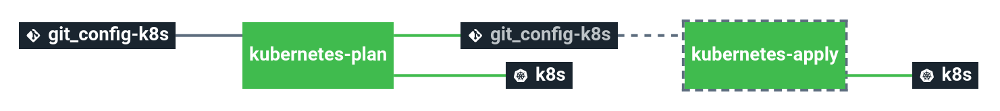

# stack-k8s-runner

This stack is meant to be use to manage resources deployed on Kubernetes cluster with terraform and/or plain manifests.

# Details

## Pipeline

> **Note** The pipeline contains a manual approval between terraform plan and terraform apply.
> That means if you trigger a terraform plan, to apply it, you have to go on terraform apply job
> and click on the `+` button to trigger it.

**Jobs description**

  * `kubernetes-plan`: Kubernetes job that will simply make a diff and dry-run of the kubernetes manifests.
  * `kubernetes-apply`: Kubernetes job that will apply the kubernetes manifests. Please see the plan diff for a better understanding.
  * `kubernetes-delete`: :warning: Kubernetes job meant to delete the whole kubernetes manifests - **NO CONFIRMATION ASKED**. If triggered, the full project **WILL** be destroyed. Use with caution.

**Variations**

There is 3 versions of the pipeline supported in this stack:
  * Classic Kubernetes: `pipeline.yml` + `variables.sample.yml` (default)
  * Amazon Elastic Kubernetes Service: `pipeline-eks.yml` + `variables-eks.sample.yml`
  * Google Kubernetes Engine: `pipeline-gke.yml` + `variables-gke.sample.yml`

Currently, Cycloid UI doesn't support switching between different pipeline variations, you will have to manually copy+paste pipeline+variables from GIT inside the Cycloid UI to use them.

> **Note** Don't forget to replace the following Cycloid UI anchors with the proper values when using a pipeline variation (the Cycloid UI does it automatically for the default one):
>   * `($ organization_canonical $)` with your Cycloid organization name.
>   * `($ project $)` with your Cycloid project name.
>   * `($ environment $)` with your target Cycloid project environment name.

**Params**

***classic***

|Name|Description|Type|Default|Required|
|---|---|:---:|:---:|:---:|
|`config_git_branch`|Branch of the config Git repository.|`-`|`master`|`True`|
|`config_git_private_key`|SSH key pair to fetch the config Git repository.|`-`|`((git_config.ssh_key))`|`True`|
|`config_git_repository`|Git repository URL containing the config of the stack.|`-`|`git@github.com:MyUser/config-k8s-runner.git`|`True`|
|`customer`|Name of the Cycloid Organization, used as customer variable name.|`-`|`($ organization_canonical $)`|`True`|
|`env`|Name of the project's environment.|`-`|`($ environment $)`|`True`|
|`k8s_kubeconfig`|Kubernetes config used to connect to the cluster.|`-`|`((raw_kubeconfig))`|`True`|
|`k8s_path`|Path to the manifest(s) to apply in the config git repository, can be either a folder or a single file.|`-`|`($ project $)/k8s/($ environment $)`|`True`|
|`k8s_version`|Kubernetes version for the concourse resource used to apply your manifests.|`-`|`'1.15'`|`True`|
|`k8s_wait_ready_selector`|Used to tell the concourse kubernetes resource to wait for a certain label selector to be ready.|`-`|`''`|`True`|
|`project`|Name of the project.|`-`|`($ project $)`|`True`|

***eks***

|Name|Description|Type|Default|Required|
|---|---|:---:|:---:|:---:|
|`aws_access_key`|Amazon AWS access key for Terraform. See value format [here](https://docs.cycloid.io/advanced-guide/integrate-and-use-cycloid-credentials-manager.html#vault-in-the-pipeline)|`-`|`((aws.access_key))`|`True`|
|`aws_secret_key`|Amazon AWS secret key for Terraform. See value format [here](https://docs.cycloid.io/advanced-guide/integrate-and-use-cycloid-credentials-manager.html#vault-in-the-pipeline)|`-`|`((aws.secret_key))`|`True`|
|`config_git_branch`|Branch of the config Git repository.|`-`|`master`|`True`|
|`config_git_private_key`|SSH key pair to fetch the config Git repository.|`-`|`((git_config.ssh_key))`|`True`|
|`config_git_repository`|Git repository URL containing the config of the stack.|`-`|`git@github.com:MyUser/config-k8s-runner.git`|`True`|
|`customer`|Name of the Cycloid Organization, used as customer variable name.|`-`|`($ organization_canonical $)`|`True`|
|`env`|Name of the project's environment.|`-`|`($ environment $)`|`True`|
|`k8s_kubeconfig`|Kubernetes config used to connect to the cluster.|`-`|`((raw_kubeconfig))`|`True`|
|`k8s_path`|Path to the manifest(s) to apply in the config git repository, can be either a folder or a single file.|`-`|`($ project $)/k8s/($ environment $)`|`True`|
|`k8s_version`|Kubernetes version for the concourse resource used to apply your manifests.|`-`|`'1.15'`|`True`|
|`k8s_wait_ready_selector`|Used to tell the concourse kubernetes resource to wait for a certain label selector to be ready.|`-`|`''`|`True`|
|`project`|Name of the project.|`-`|`($ project $)`|`True`|

***gke***

|Name|Description|Type|Default|Required|
|---|---|:---:|:---:|:---:|
|`config_git_branch`|Branch of the config Git repository.|`-`|`master`|`True`|
|`config_git_private_key`|SSH key pair to fetch the config Git repository.|`-`|`((git_config.ssh_key))`|`True`|
|`config_git_repository`|Git repository URL containing the config of the stack.|`-`|`git@github.com:MyUser/config-k8s-runner.git`|`True`|
|`customer`|Name of the Cycloid Organization, used as customer variable name.|`-`|`($ organization_canonical $)`|`True`|
|`env`|Name of the project's environment.|`-`|`($ environment $)`|`True`|
|`gcp_credentials_json`|Google Cloud Platform credentials JSON for Terraform. See value format [here](https://docs.cycloid.io/advanced-guide/integrate-and-use-cycloid-credentials-manager.html#vault-in-the-pipeline)|`-`|`((gcp_credentials.json))`|`True`|
|`k8s_kubeconfig`|Kubernetes config used to connect to the cluster.|`-`|`((raw_kubeconfig))`|`True`|
|`k8s_path`|Path to the manifest(s) to apply in the config git repository, can be either a folder or a single file.|`-`|`($ project $)/k8s/($ environment $)`|`True`|
|`k8s_version`|Kubernetes version for the concourse resource used to apply your manifests.|`-`|`'1.15'`|`True`|
|`k8s_wait_ready_selector`|Used to tell the concourse kubernetes resource to wait for a certain label selector to be ready.|`-`|`''`|`True`|
|`project`|Name of the project.|`-`|`($ project $)`|`True`|
